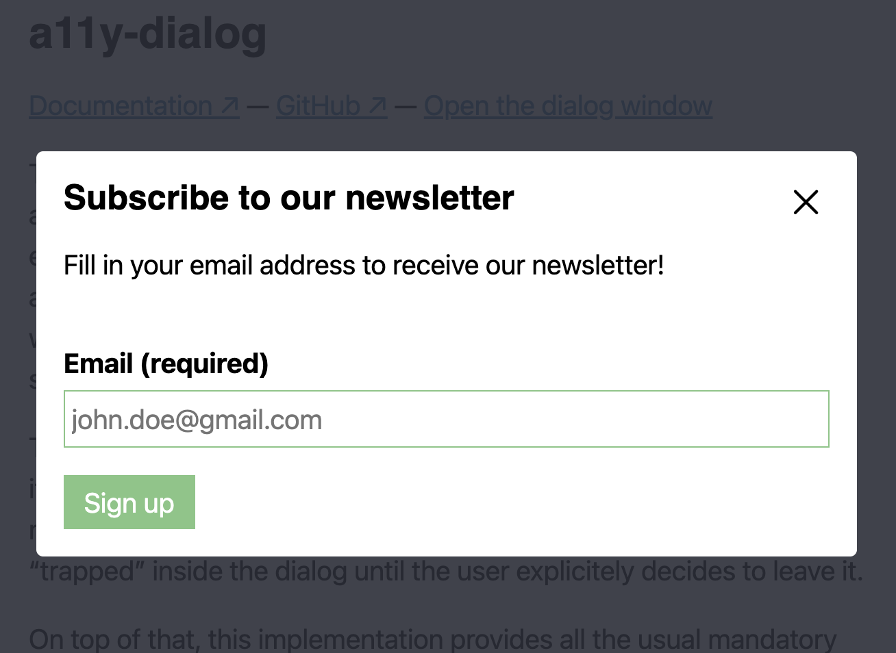
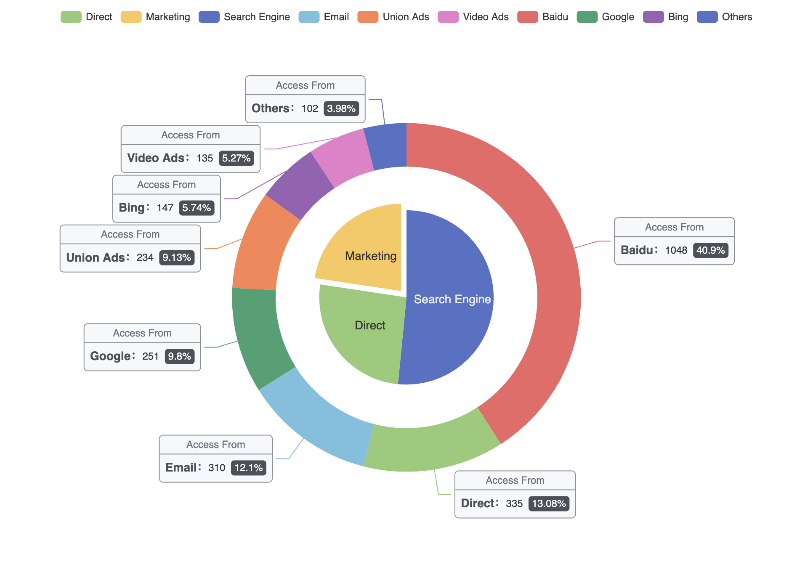

# Website Prototype 
### This is a template for a task tracking application. It is using Parcel for development, but can be run and deployed on a Node server as well using Express.

## Design Process
The design process for programming this tracker was difficult as a first time JS coder, however with the aid of API's and our tutorial demo having similarities to our task, the assessment was made easier. 

Having wireframes beforehand was extremely important in this process, as they were able to give insightful directions on how to proceed. Some designs in my wireframes have been modified to reflect my ability in JS as some designs when attempted were deemed extremely challenging based off the knowledge we have learnt thus far.

### APIs
For this assignment I used a11y-dialog, echarts and parcel.

__Parcel__\ was used for development

__a11y-dialog__\ was used for the use of pop ups as seen when adding a drink
The process of using this API was relatively simple. using npm install a11y-dialog, i was able to copy over the html, css and js that was used and modify accordingly. It was useful to see the html and modify it to my own. I was not completely confident with the layout of submissions/buttons, so with it already having a submit button it made it easier to work around the layout and implement my own. 

*__echarts__\ was used for both the donut and bar graph
These charts were extremely useful in the instance of not having to build a graph from scratch. They were limited to certain colours and paddings not being able to be adjusted, which is reflected in the design differences in my graphs, however overall they were extremely useful in handling input and being easily adjustable. 

### Drink Tracker
The most important objective of this assignment was to have a tracker, that successfully stored localstorage inputs/elements. It was also important to be able to delete inputs, as naturally human error and mistakes occur. I first set out making my tracker by creating a static html/css webpage, and then adding on from there. Once i had created my button (Add Drink), I implemented an API (A11y-dialog)
that allowed me to have a pop up. This API was extremely useful as it already had a similar submit button in it, so the CSS modifications were quite easy. No local storage was included in this API however, so I referenced Rob's tutorial scrimbas and successfully was able to track the Name, Price, Location, Time, Date, Img & Calories of each drink. Although there were many components they were relatively similar so it made the task easier as I progressed. 

The most challenging part of this section was being able to access imgs from JS (as I wanted to have a different icon for every category that comes up in my innerHTML). After some conslutation with my tutor, all that I needed was an import statement at the top of my js file... I think this addition was really important as it was really beneficial to learn that you cannot access files in js without an import, and it also added an extra level to my design.

I also have an accordian included in my design, that when clicked, shows the extra information that the user inputted. I considered displaying all the user input in my wireframes, however for aesthetic purposes and for the usefulness of the design, an accordian was the best option in my opinion. Some modifications were done to this accordian/drink layout as initially I had the remove button to only be avaliable once the accordian was clicked, but I have now changed this to always be shown, as I consider this to me more user friendly.

### Mood Tracker
Another small addition to the design was a mood tracker. This is the section which most differentiates from my wireframes (and has to do with my lack of knowledge). I initially set out to have a calender section with the mood tracker on the right hand side. This calender would have clickable (weekly/monthly/yearly) sections. The Weekly would update based on drinks submitted that week, and when monthly was clicked it would show the mood entries that were submitted as a way for users to see what they were feeling and doing on some days. After sourcing the internet and youtube for tutorials and API's there was no calender that was effective for this design. Further, after some consultation with Rob he thought it would be a good idea to just have a small mood tracker, and display the submissions somewhere to show that I am using localstorage. I took on this advice and made a similar layout to my add drinks, where it displays the day the mood entry was submitted, along with the information. If i had more time/knowledge I would have definately attempted my own code to make this calender section however for the purpose of this design I did not need to.

### Extras
Throughout my design I have two graphs (donut and bar). The donut graph was one of my most important features, that although not specifically needed in the scope of this task, i felt it was really important to show more was being tracked than just a drink to a container. When adding a drink, 5 things are updated.
*__BAC__ - The BAC levels are changed. For the purpose and scope of this design, I have hardcoded that every drink increases someones BAC by 0.02 (this is based off an average). Although not completely accurate for every drink, it provides an estimate for individuals for the process of tracking their intake and also if they are safe to drive etc. 
*__Drinks__ - This feature can be seen in the first circle at the top of the page. It displays how many drinks the user has submitted to the system. 
*__Calories__ - This feature tracks the calorie intake from each user based off the different categorys of drinks / selections. Again, as previously mentioned, every category has a hardcoded calorie for the scope of this assessment.
*__Price__ - This feature tracks the amount spent on drinks from each user. 
*__Donut Graph__ - This graph combines drinks, calories and price in a visual form. The max (when the circle completes) is set to a random number currently, as a sign up was not needed in this assignment. For the future, a sign up would be needed to see user goals and then the ring max would be based off this. 
*__Bar Graph__ - There is a bar graph at the bottom of the design, it currently only shows weekly graphs, however it updates the 'Today' section on the graph. 

### Limitations
I experiences some limitations due to lack of knowledge and using APIs. Although the API's were extremely useful, they are not always exactly what you need. The pop up dialog worked seamlessly and I have no issues regarding that, however echarts was troublesome. The data can be changed easily, however the issues with styling affected the overall design from what I set out to do. Although the donut and bar graph are extremely affective, if I was to have more time I would have attempted to code them myself, as they lacked the ability to change certain properties. For instance, I set out to have my drinks in the middle of the graph and the padding to be different, however it would not allow me to change the padding/margins to suit this. i was able to put a label in, which I have commented out in the echart.js file, however I chose to just add another circle to work around this trouble. Another issue I had with the bar graph was that the colours could not be individually changed, which wasnt a big issue, just for the aesthetics did not work with what I set out to do. Finally, the biggest limitation from this API was that the graphs do not dynamically update, meaning that when a drink is added, the graphs would only update on a force refresh of the page. I was able to work around this by adding a  .reload() in my js file, which updates the page everytime an input is submitted. This works, however it does make the design look a little 'scuffed/janky'. 

links: 
https://www.w3schools.com/css/css3_shadows.asp
https://css-tricks.com/almanac/properties/b/box-shadow/

a11y-dialog 
https://codesandbox.io/s/a11y-dialog-v7-pnwqu?file=/src/styles.css
https://a11y-dialog.netlify.app/usage/markup

input css styles
https://dev.to/yne/floating-label-over-input-cci

radio buttons for css
https://www.sliderrevolution.com/resources/styling-radio-buttons/
https://www.w3docs.com/snippets/css/how-to-style-the-selected-label-of-a-radio-button.html#:~:text=Solution%20with%20the%20CSS%20%3Achecked%20pseudo%2Dclass&text=After%20that%2C%20you%20can%20style,follows%20a%20checked%20radio%20button.

